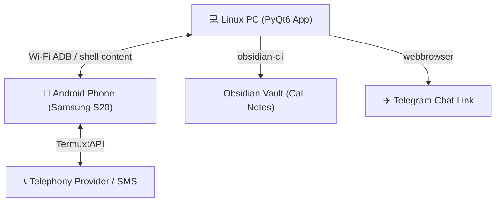

# Anwahl-App (KDE Phone Control Center) 📞📱

Anwahl-App is a powerful PyQt6-based Linux desktop client designed to seamlessly bridge your PC with your Android smartphone (tested on Samsung S20) using Wi-Fi ADB. It functions as a local telephony center, enabling dialing, call-logging, SMS history management, Obsidian call note-taking, and Telegram integration.

*Anwahl-App ist eine leistungsstarke PyQt6-basierte Linux-Desktop-Anwendung, die Deinen PC über Wi-Fi ADB nahtlos mit Deinem Android-Smartphone verbindet. Sie dient als lokale Telefonzentrale mit Direktwahl, Anrufverlauf, SMS-Verwaltung, Obsidian-Notizen und Telegram-Integration.*

---

## Architecture / Architektur 📐



---

## English README 🇬🇧

### Key Features
* 🔄 **Automatic Startup Sync:** Dynamically and silently imports contacts, call logs, and SMS from your Android device in the background at startup without freezing the GUI.
* ↩️ **Bidirectional Contact Sync:** Adding, editing, or deleting a contact in the PC app automatically pushes the changes to your phone's contact list via ADB.
* ⌨️ **Keyboard Navigation & Shortcuts:**
  * Press **Arrow Down** in the search bar to jump focus to the table and select the first item.
  * **Delete key** to delete a contact.
  * **Ctrl + W** to call (Wählen).
  * **Ctrl + S** to send SMS.
  * **Ctrl + T** to open Telegram Chat.
  * **Ctrl + B** to edit (Bearbeiten) contact.
  * **Ctrl + N** to create a new (Neu) contact.
* 🚨 **Incoming Call Monitor:** Instantly detects incoming calls on the phone, showing a desktop popup where you can accept or decline the call directly from your PC.
* 📝 **Obsidian Note Integration:** Automatically opens or appends notes for active calls in your Obsidian vault using `obsidian-cli`.
* 🌐 **System URI Integration:** Registers as the default system handler for `tel:` links. Clicking a phone number in your web browser launches the dialer instantly.
* 🔒 **Local & Private:** Everything is stored in a local SQLite database (`app.db`). Your call logs, messages, and contacts never leave your local machines.

---

### Prerequisites
* **Linux Desktop** (tested on KDE Plasma, X11 & Wayland)
* **Python 3.10+** with `PyQt6`
* **Android Device** with ADB-over-Wi-Fi enabled
* **Termux & Termux:API** installed on the phone (with SMS/Telephony permissions granted) for sending SMS via CLI.
* **obsidian-cli** (optional, for automated Obsidian note-taking)

---

### Quick Start & Installation

1. **Clone the Repository:**
   ```bash
   git clone https://github.com/alexander-graf/Anwahl-App.git
   cd Anwahl-App
   ```

2. **Configure your Phone's Wi-Fi ADB IP:**
   Create a `device_ip.txt` file in the project directory containing your phone's current Wi-Fi ADB address and port:
   ```text
   192.168.178.23:35241
   ```

3. **Set up Python Environment:**
   ```bash
   python3 -m venv venv
   source venv/bin/activate
   pip install PyQt6
   ```

4. **Launch the App:**
   ```bash
   ./run.sh
   ```

5. **Install as a System App (KDE Application Menu & tel: Handler):**
   Make the script executable and create the local files:
   ```bash
   chmod +x run.sh
   mkdir -p ~/.local/bin
   ln -sf $(pwd)/run.sh ~/.local/bin/anwahl-app
   ln -sf $(pwd)/run.sh ~/.local/bin/anwahl
   ```
   Create a desktop launcher `~/.local/share/applications/anwahl-app.desktop`:
   ```ini
   [Desktop Entry]
   Name=Anwahl-App
   Comment=KDE Phone Control Center (Android ADB)
   Exec=/home/YOUR_USER/PATH_TO_PROJECT/run.sh %u
   Icon=/home/YOUR_USER/PATH_TO_PROJECT/icon.png
   Terminal=false
   Type=Application
   Categories=Utility;Telephony;
   StartupNotify=true
   MimeType=x-scheme-handler/tel;
   ```
   Apply system settings:
   ```bash
   update-desktop-database ~/.local/share/applications
   xdg-mime default anwahl-app.desktop x-scheme-handler/tel
   ```

---

## Deutsche README 🇩🇪

### Hauptfunktionen
* 🔄 **Automatischer Startup-Sync:** Importiert beim App-Start im Hintergrund Kontakte, Anruflisten und SMS vom Smartphone in die lokale Datenbank, ohne dass die GUI einfriert.
* ↩️ **Bidirektionaler Kontakt-Sync:** Erstellen, Bearbeiten oder Löschen von Kontakten in der PC-App spiegelt sich automatisch auf der Kontaktliste Deines Handys wider.
* ⌨️ **Tastatur-Navigation & Shortcuts:**
  * **Pfeiltaste Runter** im Suchfeld verschiebt den Fokus in die Tabelle und wählt die erste Zeile aus.
  * **Entf-Taste** zum Löschen eines Kontakts.
  * **Strg + W** zum Wählen (Anrufen).
  * **Strg + S** zum Senden von SMS.
  * **Strg + T** zum Öffnen des Telegram-Chats.
  * **Strg + B** zum Bearbeiten eines Kontakts.
  * **Strg + N** zum Erstellen eines neuen Kontakts.
* 🚨 **Anruf-Monitor:** Erkennt eingehende Anrufe auf dem Handy und öffnet ein PC-Popup, um den Anruf anzunehmen, abzulehnen oder direkt eine Gesprächsnotiz anzulegen.
* 📝 **Obsidian-Integration:** Erstellt und öffnet automatisch Gesprächsnotizen in Deinem Obsidian-Tresor (`Nextcloud/ObsidianVault_ITBusiness`) via `obsidian-cli`.
* 🌐 **Systemweite tel:-Integration:** Registriert sich als Standardanwendung für `tel:`-Links in Linux. Ein Klick auf eine Telefonnummer im Browser öffnet sofort den PC-Wählmodus.
* 🔒 **Datenschutz & Lokal:** Alle Daten werden in einer lokalen SQLite-Datenbank (`app.db`) gespeichert. Keine Cloud-Übertragungen Deiner privaten Kommunikationsdaten.

---

### Systemvoraussetzungen
* **Linux Desktop** (getestet unter KDE Plasma, X11 & Wayland)
* **Python 3.10+** mit `PyQt6`
* **Android-Smartphone** mit aktivem ADB-über-WLAN
* **Termux & Termux:API** auf dem Smartphone installiert (mit SMS- und Telefonberechtigungen) für den SMS-Versand.
* **obsidian-cli** (optional, für Notizen)

---

### Installation & Einrichtung

1. **Repository klonen:**
   ```bash
   git clone https://github.com/alexander-graf/Anwahl-App.git
   cd Anwahl-App
   ```

2. **ADB-IP-Adresse des Smartphones konfigurieren:**
   Erstelle eine Datei `device_ip.txt` im Projektordner mit der ADB-Verbindungsadresse:
   ```text
   192.168.178.23:35241
   ```

3. **Virtuelle Python-Umgebung einrichten:**
   ```bash
   python3 -m venv venv
   source venv/bin/activate
   pip install PyQt6
   ```

4. **App starten:**
   ```bash
   ./run.sh
   ```

5. **Im System installieren (KDE-Menü & Standard-Handler für tel: Links):**
   ```bash
   chmod +x run.sh
   mkdir -p ~/.local/bin
   ln -sf $(pwd)/run.sh ~/.local/bin/anwahl-app
   ln -sf $(pwd)/run.sh ~/.local/bin/anwahl
   ```
   Erstelle eine Desktop-Verknüpfung unter `~/.local/share/applications/anwahl-app.desktop`:
   ```ini
   [Desktop Entry]
   Name=Anwahl-App
   Comment=KDE Telefonzentrale (Android ADB)
   Exec=/home/DEIN_USER/PFAD_ZUM_PROJEKT/run.sh %u
   Icon=/home/DEIN_USER/PFAD_ZUM_PROJEKT/icon.png
   Terminal=false
   Type=Application
   Categories=Utility;Telephony;
   StartupNotify=true
   MimeType=x-scheme-handler/tel;
   ```
   Einstellungen im System aktivieren:
   ```bash
   update-desktop-database ~/.local/share/applications
   xdg-mime default anwahl-app.desktop x-scheme-handler/tel
   ```
